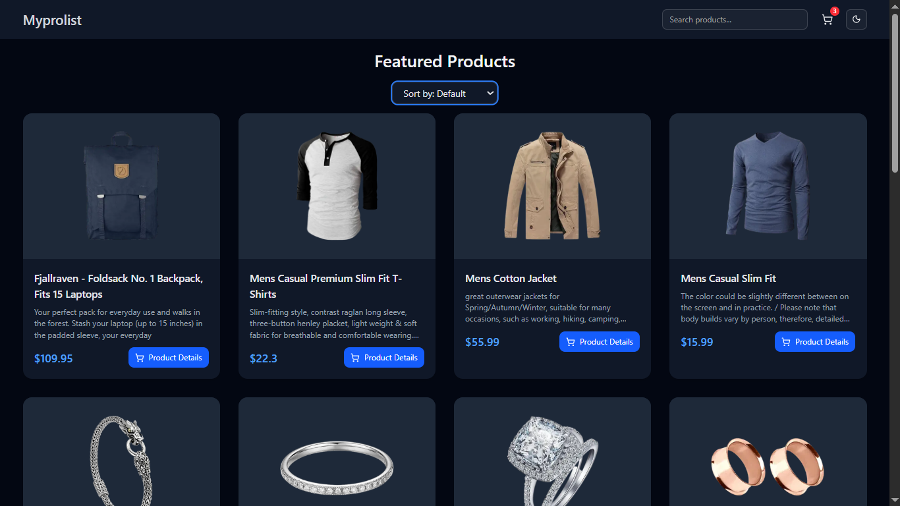
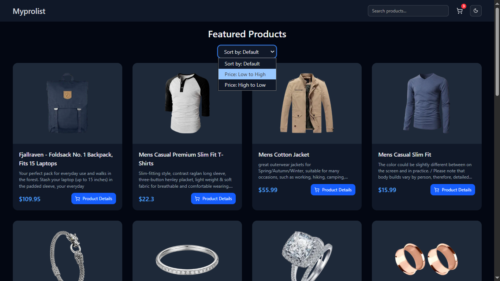
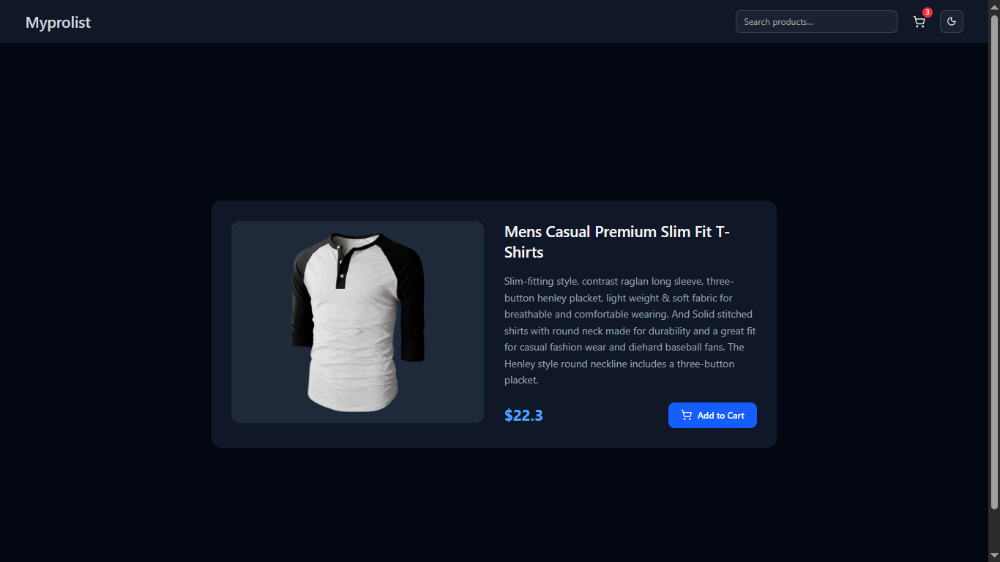
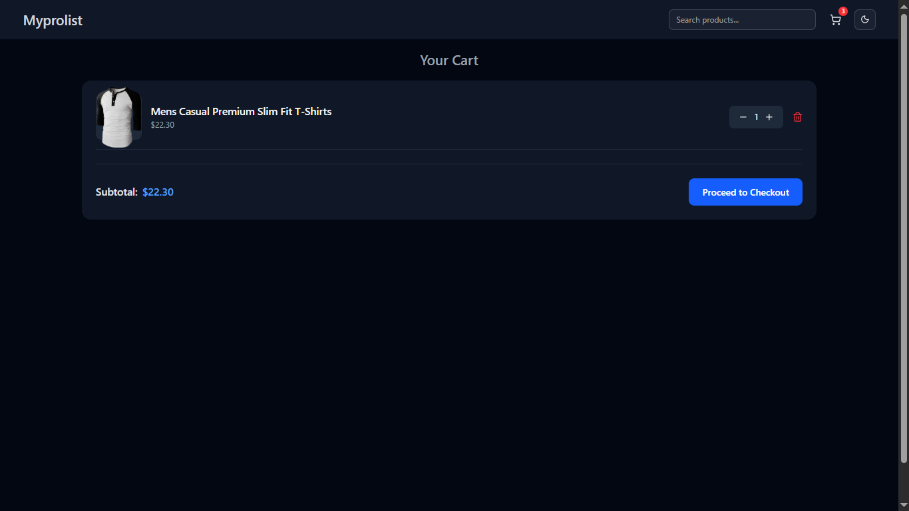
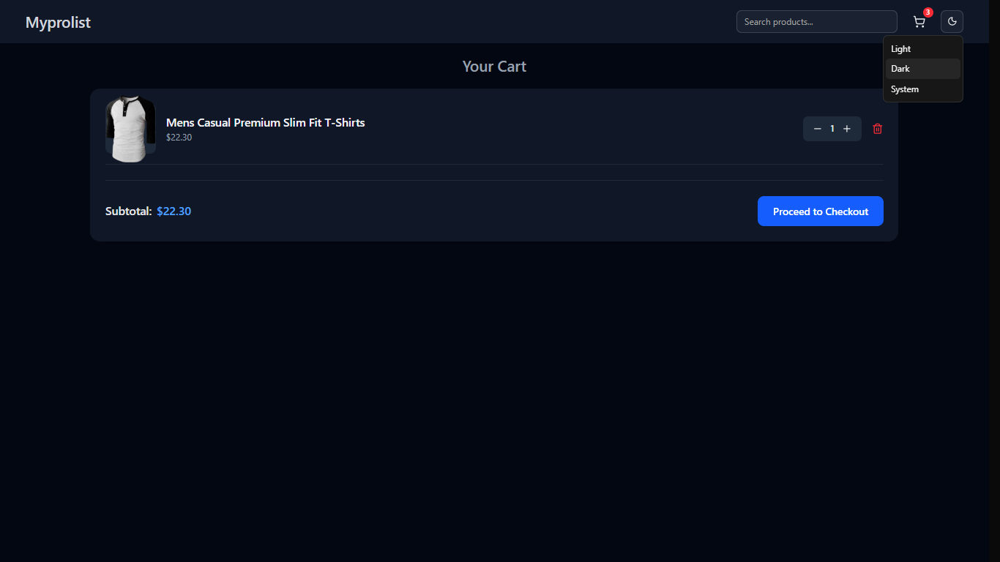

# 🛒 Myprolist

A modern e-commerce product listing application built with **Next.js** and **Tailwind CSS**.  
It provides product browsing, sorting, cart management, and theme switching functionalities — all wrapped in a clean, responsive UI.

---

## 🚀 Features

### 🏷️ Product Listing
- Fetches products dynamically from the **FakeStore API**.
- Displays essential product details including image, title, description, and price.
- Uses **localStorage caching** to reduce API calls and speed up reloads.


### 🔍 Sorting System
- Users can sort products by:
  - **Default Order**
  - **Price: Low to High**
  - **Price: High to Low**
- Sorting is applied instantly without page reload.


### 🛍️ Product Details Page
- Clicking on any product opens a detailed view with:
  - Larger image
  - Full description
  - Price information
  - “Add to Cart” button


### 🛒 Cart Management
- Add, remove, and update quantity of products in the cart.
- Displays **subtotal** dynamically.
- “Proceed to Checkout” button for next steps.


### 🌙 Theme Switcher
- Toggle between **Light**, **Dark**, or **System** theme.
- Automatically adapts to the user’s OS preference.


### 💾 Local Storage Caching
- Product data is stored locally for faster reloads and reduced network dependency.

### 📱 Fully Responsive
- Optimized for all devices — from **mobile (250px width)** to large screens.

---

## 🧩 Tech Stack

| Technology | Purpose |
|-------------|----------|
| **Next.js** | Framework for building React-based full-stack apps |
| **React** | Frontend UI library |
| **Tailwind CSS** | Styling and responsive design |
| **TypeScript** | Type-safe codebase |
| **FakeStore API** | Product data source |
| **LocalStorage** | Client-side caching |

---

## ⚙️ Project Setup

Follow these steps to set up and run the project on your local machine.

### 1. Clone the Repository
```bash
# Clone the repo
git clone https://github.com/<your-username>/myprolist.git

# Navigate into it
cd myprolist

# Install dependencies
npm install

# Start development server
npm run dev

